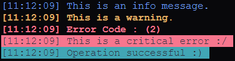

# `mlog` - Rust Logger

## Features
Supports varying log levels, colorized output, optional file logging, async mode, multithreaded mode. 
  
## Log Level Colors



## Usage 

```rust
info!("This is an info message.");
warn!("This is a warning.");
error!("This is an error.");
crit!("Critical error, application will terminate.");
success!("Operation successful!");
````

## Initialization

You can initialize logger with any log level, any lower priority logs will be automatically removed

```rust
mlog::init(log_config);
// ...
mlog::shutdown(); // need to shutdown logger safely before exiting.
````

## Configuration
```rust
let log_config = LogConfig {
    log_level: LogLevel::Info,                 // defaults to logging Everything
    program_name: "application".to_string(),  
    log_filepath: Some("logs/example"),      // filepath for logs (default : None uses console only)
    console_flag: true,                     // toggle console logging
    async_flag: true,                     // async logger (default to false)
    multi_threaded_flag: true,           // single-threaded by default
    time_format: "%Y-%m-%d %H:%M:%S%.3f".to_string(),  // fully customizable time format
}
````

Additionally, if you build with `performance` all logs that are not errors or critical errors are removed at compile time (for release builds only).